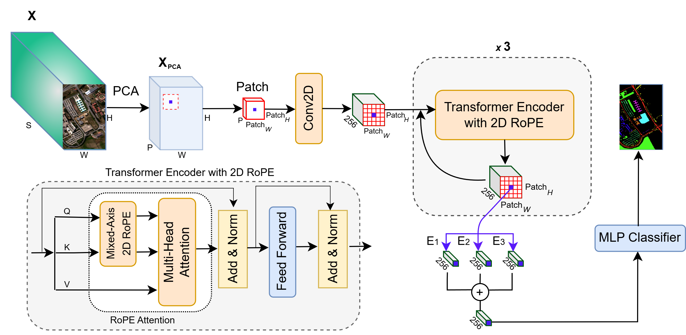
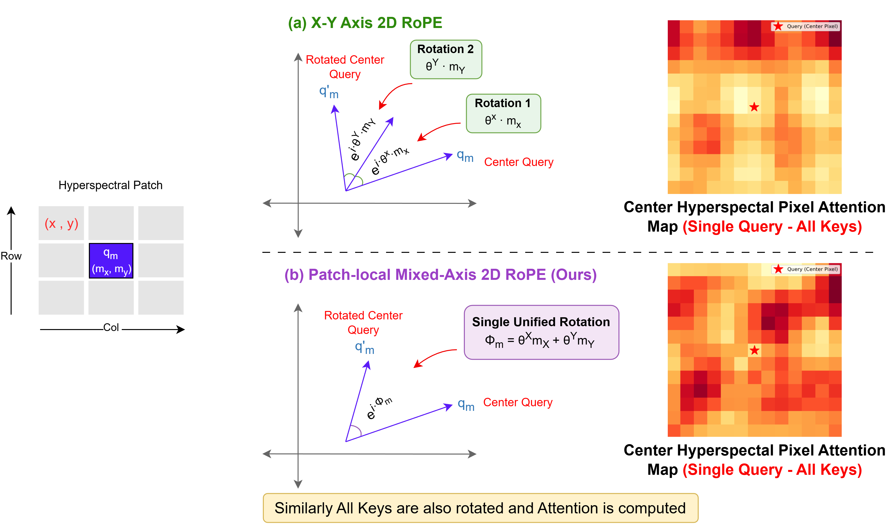

# HyperRoPE-SST 🛰️🔬

<p align="center">
<a href="https://doi.org/10.1109/JSTARS.2025.3643365"></a>
<a href="https://github.com/zirakkk/hyperrope-sst"></a>
<a href="https://creativecommons.org/licenses/by-nc-sa/4.0/"></a>
</p>

<h3 align="center">Spatial-Spectral Transformer with Patch-Local Mixed-Axis 2D Rotary Position Embedding for Hyperspectral Image Classification [IEEE JSTARS 2025 🔥]</h3>

<h4 align="center"><a href="https://scholar.google.com/citations?user=T4oy5R0AAAAJ">Zirak Khan</a>, Noyon Dey, Kavya Kathiravan, Seung-Chul Yoon, Suchendra Bhandarkar</h4>

<h4 align="center"><strong>University of Georgia & U.S. Department of Agriculture</strong></h4>

---

#### **Performance Benchmarks**

[](#)
[](#)
[](#)
[](#)
[](#)

---

## 📢 Latest Updates

- **Dec-04-25**: HyperRoPE-SST accepted at **IEEE JSTARS**! 🔥🥳
- **Dec-01-25**: Open-sourced implementation with 8 baseline models for comprehensive comparison 🔥

---

## HyperRoPE-SST Overview 💡

**HyperRoPE-SST** is a transformer-based architecture that introduces **patch-local mixed-axis 2D Rotary Position Embedding (RoPE) with learnable frequencies** for hyperspectral image classification. Unlike traditional absolute or bias-based positional embeddings that fail to preserve geometric relationships, our approach maintains precise diagonal and multi-directional spatial-spectral interactions between pixels within hyperspectral patches while adapting to dataset-specific characteristics.

The pipeline employs **PCA for spectral dimensionality reduction**, extracts **target-centered local patches**, embeds them using **shallow convolutions**, and applies a **2D RoPE-enhanced transformer encoder** with **center-focused attention** to produce context-aware target pixel embeddings. HyperRoPE-SST consistently outperforms state-of-the-art CNN and transformer-based models across five benchmark datasets, demonstrating superior accuracy for land-cover classification, environmental monitoring, and remote sensing applications.

---

## Key Features 🏆

- **Patch-Local Mixed-Axis 2D RoPE**: Novel learnable frequency-based rotary position embedding that preserves geometric relationships and captures diagonal/multi-directional spatial-spectral interactions
- **Dataset-Adaptive Learning**: Learnable frequencies adapt to dataset-specific spatial-spectral characteristics during training
- **Center-Focused Attention**: Weighted aggregation of center pixel representations across transformer layers for precise target pixel classification
- **State-of-the-Art Performance**: Achieves 96.81%, 95.65%, 93.38%, 99.62%, and 95.59% OA on IP, PU, HU, KSC, and SAL respectively
- **Comprehensive Baseline Comparison**: Includes 8 state-of-the-art models (CNN-based, ViT-based and hybrid architectures)

---

## Architecture ⚙️

### Overall Framework

<p align="center">
  
  <br>
  <em>Overall architecture of HyperRoPE-SST showing the complete pipeline from hyperspectral patch to classification </p>

### Patch-local Mixed-Axis 2D RoPE

<p align="center">
  
  <br>
  <em> Comparison between (a) X–Y axis 2D RoPE and (b) the proposed patch-local mixed-axis 2D RoPE. Left: geometric rotation interpretation for a
sample center-pixel query. Right: attention heatmaps for a single query token over all keys in the hyperspectral patch. The proposed mixed-axis formulation
captures diagonal and off-axis spatial-spectral relationships more accurately and produces smoother, radially consistent attention patterns`</em>`</p>


---


## Directory Structure 📁

```
hyperrope-sst/
├── configs/                         # Model configurations
│   ├── config.py              
│   ├── hyper2Drope.json             # Hyper2DRoPE configuration
│   ├── lsga_vit.json                # LSGA-ViT configuration
│   ├── hit.json                     # HiT configuration
│   ├── spectralformer.json          # SpectralFormer configuration
│   ├── sqsformer.json               # SQSFormer configuration
│   ├── conv2d.json                  # Conv2D configuration
│   ├── conv3d.json                  # Conv3D configuration
│   └── ssrn.json                    # SSRN configuration
├── data/                  
│   ├── data_loader.py               # Multi-file HSI data loader
│   └── dataset/                     # Dataset directory
│       ├── Houston/                 # Houston dataset (.mat files)
│       ├── IndianPine/              # Indian Pines dataset
│       ├── KSC/                     # Kennedy Space Center dataset
│       ├── Pavia/                   # Pavia University dataset
│       └── Salinas/                 # Salinas dataset
├── models/                          # Model implementations
│   ├── hyperrope_vit.py             # Hyper2DRoPE (Ours)
│   ├── lsga_vit.py                  # LSGA-ViT
│   ├── hit.py                       # HiT
│   ├── spectralformer.py            # SpectralFormer
│   ├── sqsformer.py                 # SQSFormer
│   ├── conv2d.py                    # 2D CNN baseline
│   ├── conv3d.py                    # 3D CNN baseline
│   └── ssrn.py                      # SSRN
├── utils/                   
│   ├── trainer.py                   # Training logic for all models
│   ├── evaluation.py                # Evaluation metrics (OA, AA, Kappa)
│   ├── visualization.py             # Classification map visualization
│   └── utils.py                     # Helper functions
├── checkpoints/                     # Best model checkpoints (8 models × 5 datasets = 40 .pth files)
├── classification_maps/             # Generated classification maps
│   ├── Houston/
│   ├── IndianPine/
│   ├── KSC/
│   ├── Pavia/
│   └── Salinas/
├── results/                         # Evaluation results (JSON)
│   ├── 1) IndianPine Best Models Results/
│   ├── 2) Pavia Best Models Results/
│   ├── 3) Houston Best Models Results/
│   ├── 4) KSC Best Models Results/
│   └── 5) Salinas Best Model Results/
├── environment.yml                  # Conda environment specification
├── main.py                          # Unified entry point
└── README.md                        # This file
```

---

## Installation

### Prerequisites

- Python 3.10+
- CUDA 11.8+ (for GPU acceleration)
- Conda package manager
- 8GB+ GPU memory recommended

### Setup 🔧

We recommend setting up a conda environment for the project:

```bash
# Create and activate environment
conda env create -f environment.yml
conda activate plasticseg

# Clone repository
git clone https://github.com/zirakkk/hyperrope-sst.git
cd hyperrope-sst
```

### Download Datasets 📥

Download the five benchmark hyperspectral datasets from the [GIC Hyperspectral Remote Sensing Scenes](http://www.ehu.eus/ccwintco/index.php/Hyperspectral_Remote_Sensing_Scenes) repository or IEEE GRSS Data Fusion Contest archives. Place the `.mat` files in their respective subdirectories: `IndianPine.mat` → `data/dataset/IndianPine/`, `Pavia.mat` → `data/dataset/Pavia/`, `Houston.mat` → `data/dataset/Houston/`, `KSC.mat` → `data/dataset/KSC/`, and `Salinas.mat` → `data/dataset/Salinas/`. And split the data into TR, VA and TE using `generate_splits.py` which replicates spectralformer paper splits.

For a complete list of dependencies, see [`environment.yml`](environment.yml).

---

## Quick Start Examples 🚀

### Training & Testing HyperRoPE-SST (Our Method)

```bash
# Train HyperRoPE-SST on Indian Pines dataset
python main.py --config hyper2Drope.json --dataset IndianPine --model Hyper2DRoPE

# Train on other datasets (Pavia, Houston, KSC, Salinas)
python main.py --config hyper2Drope.json --dataset Pavia --model Hyper2DRoPE
python main.py --config hyper2Drope.json --dataset Houston --model Hyper2DRoPE
python main.py --config hyper2Drope.json --dataset KSC --model Hyper2DRoPE
python main.py --config hyper2Drope.json --dataset Salinas --model Hyper2DRoPE
```

### Training Baseline Models

The repository supports 7 baseline models with the same command structure:

```bash
# Example: Train LSGA-ViT on Salinas dataset
python main.py --config lsga_vit.json --dataset Salinas --model LSGA_ViT

# Other models: HiT, SpectralFormer, SQSFormer, Conv2d, Conv3d, SSRN
# Replace --config [model].json, --dataset [DatasetName], --model [ModelName]
```

**Available Options:**

- `--config`: `hyper2Drope.json`, `lsga_vit.json`, `hit.json`, `spectralformer.json`, `sqsformer.json`, `conv2d.json`, `conv3d.json`, `ssrn.json`
- `--dataset`: `IndianPine`, `Pavia`, `Houston`, `KSC`, `Salinas`
- `--model`: `Hyper2DRoPE`, `LSGA_ViT`, `HiT`, `SpectralFormer`, `SQSFormer`, `Conv2d`, `Conv3d`, `SSRN`

---

## Configuration ⚙️

Each model has a dedicated JSON configuration file in the `configs/` directory. Key parameters include:

### Network Architecture Parameters

```json
{
  "net": {
    "trainer": "hyperrope_vit",
    "pos_encoding_type": "rope_2d_mixed",     // Options: "rope_2d_axial", "absolute"
    "depth": 3,                             // Number of transformer layers
    "dim": 64,                              // Embedding dimension
    "heads": 8,                             // Number of attention heads
    "mlp_intermediate_dim": 256,              // MLP hidden dimension
    "kernal": 3,                             // Conv kernel size
    "padding": 1                            // Conv padding
  }
}
```

### Training Parameters

```json
{
  "train": {
    "epochs": 200,                          // Maximum training epochs
    "patience": 100,                        // Early stopping patience
    "lr": 0.001,                          
    "weight_decay": 0                   
  }
}
```

### Dataset-Specific Parameters

```json
{
  "datasets": {
    "Salinas": {
      "data_sign": "Salinas",
      "num_classes": 16,                    // Number of classes
      "patch_size": 21,                      // Spatial patch size
      "pca": 11,                            // PCA components (0 = no PCA)
      "spectral_size": 204,                   // Original spectral bands
      "batch_size": 40,
      "padding": true                        // Whether to pad image borders
    }
  }
}
```

---

## Results 📊

### Quantitative Results

**HyperRoPE-SST** achieves state-of-the-art performance across all five benchmark datasets, demonstrating the effectiveness of patch-local mixed-axis 2D RoPE with learnable frequencies:

| **Dataset** | **OA (%)** | **AA (%)** | **Kappa (κ)** |
| :---------------: | ---------------- | ---------------- | -------------------- |
|   Indian Pines   | **96.81**  | **95.73**  | **0.9634**     |
| Pavia University | **95.65**  | **94.82**  | **0.9420**     |
|   Houston 2013   | **93.38**  | **93.01**  | **0.9271**     |
|        KSC        | **99.62**  | **99.54**  | **0.9957**     |
|      Salinas      | **95.59**  | **97.12**  | **0.9509**     |

HyperRoPE-SST consistently outperforms CNN-based models (Conv2D, Conv3D, SSRN) and transformer-based methods (LSGA-ViT, HiT, SpectralFormer, SQSFormer) across all metrics. Detailed per-class accuracies available in paper.

### Qualitative Results

All predicted maps are available in `classification_maps/` with ground truth references and model predictions for qualitative comparison.

<p align="center">
  
  <br>
  <em> Predicted classification maps of the Pavia University dataset: (a) Ground truth, (b) 2D CNN (OA = 86.12%), (c) 3D CNN (OA = 83.92%), (d) SSRN (OA =
87.09%), (e) SF (OA = 82.35%), (f) HiT (OA = 79.73%), (g) LSGA (OA = 83.92%), (h) SQS (OA = 92.27%), (i) Ours (OA = 95.65% </p>


---

## Pretrained Models 💾

The `checkpoints/` directory stores the best-performing model weights for each model-dataset combination (8 models × 5 datasets = 40 `.pth` files). Each checkpoint is saved after achieving the highest validation accuracy during training and can be used for inference or fine-tuning on related tasks.

---

## Acknowledgements 🙏

- **IEEE GRSS** for providing benchmark hyperspectral datasets
- **Remote Sensing Community** for open-source models

This work was supported by the U.S. Department of Agriculture-Agricultural Research Service (USDA-ARS). Thanks to Dr. Seung-Chul Yoon for his unwavering support throughout the project.Special thanks to all co-authors for their valuable contributions and insights throughout the project.

---

## Citation 📜

If you use HyperRoPE-SST in your research, please cite our paper:

```bibtex
@article{khan2025hyperrope,
  title={Spatial-Spectral Transformer with Patch-Local Mixed-Axis 2D
  Rotary Position Embedding for Hyperspectral Image Classification},
  author={Khan, Zirak and Dey, Noyon and Kathiravan, Kavya and Yoon, 
  Seung-Chul and Bhandarkar, Suchendra M.},
  journal={IEEE Journal of Selected Topics in Applied Earth Observations
  and Remote Sensing},
  year={2025},
  doi={10.1109/JSTARS.2025.3643365}
}
```

---

## Contact ✉️

For questions, collaborations, or support:

- 📧 **Email**: Zirak.khan@uga.edu
- 🐛 **Issues**: [GitHub Issues](https://github.com/ZirakKhan/hyperrope-sst/issues)

---

## License

This project is licensed under the [Creative Commons Attribution-NonCommercial-ShareAlike 4.0 International License](http://creativecommons.org/licenses/by-nc-sa/4.0/).

---

Looking forward to your feedback, contributions, and stars! 🌟

<p align="center">
    
    
    
</p>
